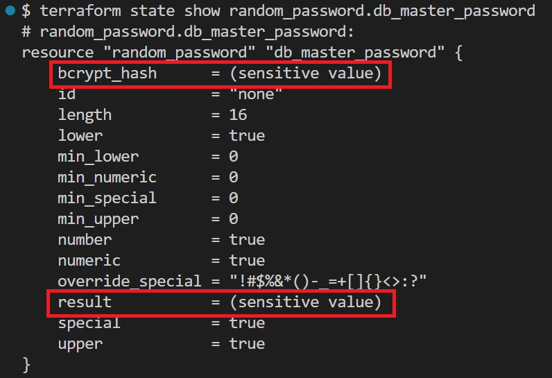
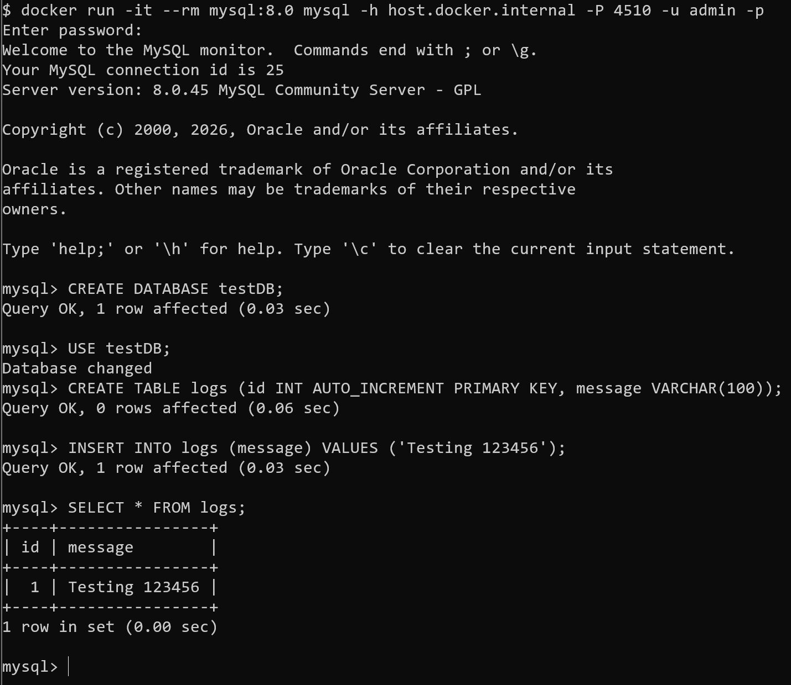
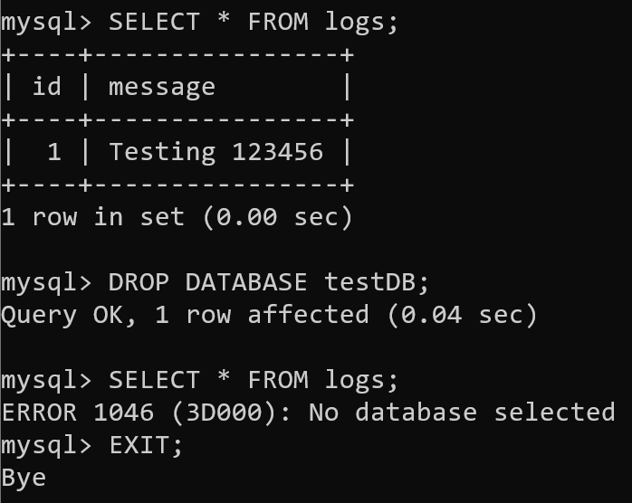

# Data Lake Infrastructure PoC (Terraform + AWS)

## 📌 Project Overview
This Proof of Concept (PoC) repository demonstrates the provisioning of a secure, highly available data infrastructure on AWS using **Terraform**. To optimize testing costs and iterate rapidly, the environment is fully simulated locally using **LocalStack**.

The architecture includes a secure VPC network, an isolated RDS database accessible via a Bastion Host, a versioned S3 Data Lake, and robust IAM role-based access control (RBAC).

## 🏗️ Architecture Design
*[Placeholder: Architecture Diagram will be inserted here]*

### Core Components:
- **Networking:** VPC, Public/Private Subnets, Internet Gateway, Route Tables.
- **Compute:** EC2 Bastion Host (dynamically fetching the latest Amazon Linux 2 AMI).
- **Storage:** S3 Bucket for Raw Data Lake (Versioning enabled, AES256 Server-Side Encryption).
- **Database:** RDS MySQL 8.0 deployed in a private subnet group.
- **Security & Identity:**
  - IAM Groups (Data Engineers, Data Analysts, DBAs) with principle of least privilege.
  - AWS Secrets Manager for secure, dynamic generation of the RDS master password.
  - Security Groups restricting database access exclusively to the Bastion Host.

## 🚀 Quick Start (LocalStack Emulation)

### Environments
- Docker Desktop (4.41.2 (191736))
- Terraform (v1.14.8 on windows_amd64)
- LocalStack CLI (v2026.3.0-windows-amd64)

### Deployment Steps
1. **Start LocalStack:**
   ```bash
   localstack auth set-token <your-auth-token>
   localstack start

2. **Initialize Terraform:**
   ```bash
   terraform init
   ```

3. **Before Deploy, check plan:**
   ```bash
   terraform apply
   ```

4. **Deploy Infrastructure:**
   ```bash
   terraform apply
   ```

5. **Retrieve Database Credentials (Securely generated by IaC):**
   ```bash
   terraform state show random_password.db_master_password
   ```

  
  *(Note: Terraform natively masks sensitive outputs like `bcrypt_hash` and `result` to prevent credential leakage in terminal logs.)*

5. **Verify Database Connection (Application Layer Test):**
  To prove the infrastructure's readiness, we established a direct connection using a disposable Docker MySQL client and performed full CRUD operations to validate the deployment.

*Database Creation & Data Insertion:*


*Data Retrieval & Teardown Verification:*


## 🛠️ Infrastructure as Code (IaC) Optimization & Troubleshooting

During the development of this PoC, several environment and architecture challenges were addressed to ensure a robust, production-ready deployment:

- **Engine Sandbox & Daemon Permissions:** Initially attempted to run the simulator via a lightweight `docker run` command. However, provisioning deep-level resources like RDS requires Docker Socket access. Refactored the environment initialization to use the official `localstack CLI`, correctly mounting `/var/run/docker.sock` and resolving deployment deadlocks.
- **Dynamic Resource Dependency:** Resolved `InvalidAMIID` errors by refactoring hardcoded static EC2 configurations. Implemented `data "aws_ami"` blocks to dynamically fetch region-specific machine images, ensuring the code is fully portable across different AWS regions.
- **Endpoint Routing Leakage:** Identified an API routing issue where Terraform's AWS Provider (v6+) decoupled the `s3control` endpoint, causing traffic to leak to public AWS servers resulting in `HTTPS/DNS` errors. Resolved by explicitly mapping the `s3control` endpoint to a wildcard local DNS (`*.localhost.localstack.cloud`), enforcing strict traffic containment within the local emulator.

## 🧹 Cleanup
```bash
terraform destroy
localstack stop
```